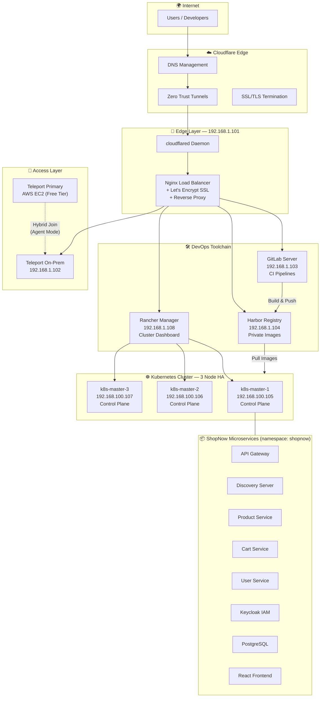
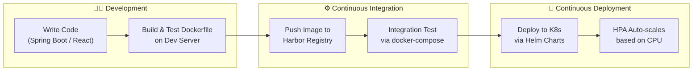

<p align="center">
  
  
  
  
  
  
  
  
</p>

# 🏗️ On-Premises DevSecOps Platform & Microservices Deployment

> **A fully self-hosted, enterprise-grade DevSecOps platform** built from scratch on Virtual Machines — featuring a complete CI/CD toolchain, Zero Trust access control, private container registry, and a production-ready Kubernetes cluster. Designed to simulate real-world corporate infrastructure within a home lab environment.

---

## 📖 Project Overview

This project represents several months of hands-on infrastructure engineering, solving real operational challenges that typically arise in enterprise on-premise environments — ISP port blocking, SSL certificate management without public IPs, secure remote access, constrained hardware resources, and end-to-end deployment automation.

**What makes this project stand out:**

- 🔧 **Built from zero** — Every VM, every service, every network route was manually planned and provisioned
- 🧠 **Problem-solving driven** — Each infrastructure decision was a response to a real constraint (ISP blocking, limited RAM/CPU, NAT limitations)
- 🔒 **Security-first architecture** — Zero Trust access (Teleport), private registry (Harbor), encrypted tunnels (Cloudflare), no exposed inbound ports
- 📦 **Full application lifecycle** — From source code (Spring Boot microservices) through CI/CD pipeline to Kubernetes deployment with auto-scaling

---

## 🏛️ Platform Architecture



### VM Infrastructure Map

| Server | IP | Role | Key Software |
|---|---|---|---|
| **LB Node** | `192.168.1.101` | Public Load Balancer + Tunnel Endpoint | Nginx, cloudflared, Certbot |
| **Teleport Node** | `192.168.1.102` | Zero Trust Access Gateway | Teleport v13 (On-Prem Agent) |
| **GitLab Node** | `192.168.1.103` | Source Code + CI Pipeline | GitLab EE 15.7 |
| **Harbor Node** | `192.168.1.104` | Private Container Registry | Harbor (Docker Compose) |
| **K8s Master 1** | `192.168.1.105` | Control Plane (Primary) | kubeadm, kubelet, kubectl |
| **K8s Master 2** | `192.168.1.106` | Control Plane | kubeadm, kubelet |
| **K8s Master 3** | `192.168.1.107` | Control Plane | kubeadm, kubelet |
| **Rancher Node** | `192.168.1.108` | Cluster Management UI | Rancher (Docker) |
| **Dev Server** | Separate VM | Development & Testing | Docker, docker-compose |
| **Teleport Cloud** | AWS EC2 (t3.micro) | Teleport Primary (Hybrid) | Teleport v17 |

---

## 🔄 DevOps Workflow



**Development Workflow (step-by-step):**

1. **Code** on local machine or Dev Server
2. **Build & Test** Dockerfile locally on isolated Dev Server
3. **Push** verified image to private Harbor registry (`harbor.kihpn.online/shopnow/*`)
4. **Integration Test** full stack with `docker-compose` on Dev Server
5. **Deploy** to Kubernetes cluster using K8s YAML manifests
6. **HPA** automatically scales pods based on CPU utilization (min: 1, max: 2, target: 50%)

---

## 🛠️ Tech Stack

| Layer | Technology | Purpose |
|---|---|---|
| **Virtualization** | VMware | Host all on-premise VMs |
| **Networking** | Nginx (L7 Reverse Proxy) | Load balancing, SSL termination, routing |
| **DNS & CDN** | Cloudflare | DNS management, DDoS protection |
| **Tunneling** | Cloudflare Tunnel (`cloudflared`) | Bypass ISP port blocking, Zero Trust ingress |
| **SSL/TLS** | Let's Encrypt (DNS-01 Challenge) | Free SSL certificates without public port access |
| **Access Control** | Teleport (Hybrid: AWS + On-Prem) | Zero Trust SSH/K8s access, audit logging |
| **Source Control** | GitLab EE (Self-hosted) | Git repos, CI/CD pipelines |
| **Container Registry** | Harbor (Self-hosted) | Private, secure image storage |
| **Container Runtime** | containerd | CRI-compliant runtime for Kubernetes |
| **Orchestration** | Kubernetes v1.30 (kubeadm, 3-node HA) | Production-grade container orchestration |
| **CNI** | Calico | Network policy, pod networking |
| **Ingress** | NGINX Ingress Controller (NodePort) | L7 routing inside K8s cluster |
| **Cluster Management** | Rancher | Web UI for K8s operations |
| **Package Management** | Helm v3 | Templated Kubernetes deployments |
| **Auto-scaling** | HPA (Horizontal Pod Autoscaler) | Scale pods by CPU (50% threshold) |
| **Authentication** | Keycloak (OAuth2/OIDC) | SSO for ShopNow microservices |
| **Database** | PostgreSQL, MySQL | Application data, Keycloak backend |
| **Application** | Spring Boot (Java), React (JS) | ShopNow e-commerce platform |

---

## 📦 Application: ShopNow E-Commerce Platform

A Spring Boot microservices application with service discovery, API gateway, and Keycloak-based authentication.

| Service | Tech | Port | Description |
|---|---|---|---|
| **API Gateway** | Spring Cloud Gateway | 5860 | Request routing, JWT validation |
| **Discovery Server** | Eureka | 8761 | Service registration & discovery |
| **Config Server** | Spring Cloud Config | 5859 | Centralized configuration |
| **Product Service** | Spring Boot | 5861 | Product catalog CRUD |
| **Shopping Cart Service** | Spring Boot | 5863 | Cart management |
| **User Service** | Spring Boot | 5865 | User profiles & auth |
| **Keycloak** | Keycloak 23.0 | 8080 | Identity & Access Management |
| **PostgreSQL** | PostgreSQL | 5432 | Application databases |
| **Frontend** | React | 3000 | Customer-facing web UI |

All services are containerized, stored in Harbor (`harbor.kihpn.online/shopnow/*`), and deployed to the `shopnow` namespace on Kubernetes.

---

## 📁 Repository Structure

```
.
├── architecture/                 # Platform architecture diagrams (Mermaid)
│   └── overview.md
├── teleport/                     # Zero Trust access — 3 deployment methods
│   ├── 00-getting-started.md     # Method selection guide
│   ├── method-1-public-ip.md     # Public IP + LoadBalancer
│   ├── method-2-cloudflare-tunnel.md  # DNS-01 + Tunnel (ISP bypass)
│   ├── method-3-aws-quick-deploy.md   # AWS EC2 (Hybrid Primary)
│   ├── teleport.yaml.example    # Config template
│   └── teleport.service         # Systemd unit file
├── gitlab/                       # Self-hosted GitLab deployment
│   ├── method-1-public-ip.md     # Standard SSL setup
│   └── method-2-cloudflare-tunnel.md  # Tunnel + DNS-01 setup
├── harbor/                       # Private container registry
│   └── LB-to-harbor.md          # Zero-Trust architecture guide
├── rancher-k8s/                  # Kubernetes cluster setup
│   ├── k8s-3node-controlplane.md # 3-node HA (kubeadm + containerd)
│   ├── method-a-public-https.md  # Rancher with public HTTPS
│   └── method-b-cloudflare-tunnel.md  # Rancher via Tunnel
├── nginx/                        # Load Balancer configurations
│   └── lb.conf.example
├── cloudflared/                  # Cloudflare Tunnel configs
│   └── config.yml.example
├── Shopnow-yaml/                 # K8s manifests for ShopNow app
│   ├── shopnow-api-gateway.yaml
│   ├── shopnow-discovery-server.yaml
│   ├── shopnow-product-service.yaml
│   ├── shopnow-cart-service.yaml
│   ├── shopnow-user-service.yaml
│   ├── shopnow-frontend.yaml
│   ├── shopnow-keycloak-mysql.yaml
│   ├── shopnow-keycloak-realms.yaml
│   └── shopnow-postgresql.yaml
├── template/                     # Reusable K8s resource templates
│   ├── *-deployment.yaml
│   ├── *-service.yaml
│   ├── *-autoscaling.yaml        # HPA configuration
│   ├── *-configmap.yaml
│   └── *-secret.yaml
├── shopnow-backend/              # Spring Boot microservices source
│   ├── api-gateway/
│   ├── config-server/
│   ├── discovery-server/
│   ├── product-service/
│   ├── shopping-cart-service/
│   ├── user-service/
│   ├── keycloak-realms/
│   └── docker-compose.yaml       # Local dev/test stack
├── shopnow-frontend/             # React frontend source
│   ├── src/
│   ├── Dockerfile
│   └── package.json
├── docs/                         # Operational notes
│   └── notes.md
└── troubleshooting/              # Issue resolution logs
```

---

## 🔥 Challenges Solved (Real-World Problem Solving)

### Challenge 1: ISP Blocks Inbound Ports 80/443

**Problem:** Vietnamese ISPs (VNPT, Viettel) block incoming traffic on ports 80 and 443 for residential connections. This prevents Let's Encrypt HTTP-01 challenge and direct HTTPS access to on-premise servers.

**Solution:**
1. Switched SSL certificate issuance from **HTTP-01** to **DNS-01 Challenge** via Cloudflare API — no inbound ports required
2. Deployed **Cloudflare Tunnels** (`cloudflared`) on the LB node — creates an outbound-only encrypted tunnel to Cloudflare's edge network
3. All services (GitLab, Harbor, Rancher, Teleport) are accessible via custom domains without any router port forwarding

```
Before: Internet → [BLOCKED by ISP] → On-Prem servers
After:  Internet → Cloudflare Edge → Tunnel (outbound only) → Nginx LB → Services
```

### Challenge 2: Secure Remote Access Without VPN

**Problem:** Need SSH and K8s cluster access from anywhere, but opening SSH ports (22) to the internet is a security risk.

**Solution:** Implemented **Teleport** in a **Hybrid architecture**:
- **Primary node** runs on AWS EC2 (Free Tier) with a public IP — handles authentication and certificate authority
- **Agent nodes** run on-premise — connect outbound to the AWS primary
- Result: full SSH and `kubectl` access through Teleport's Web UI with session recording and RBAC — zero inbound ports opened on the home network

### Challenge 3: Resource Optimization on Constrained Hardware

**Problem:** Running 8+ VMs plus a 3-node K8s cluster on limited home lab hardware. Pods were getting evicted due to Disk Pressure and Memory Pressure.

**Solution:**
- Defined strict **Resource Requests/Limits** on every K8s pod (CPU: 100m–300m, Memory: 64Mi–256Mi)
- Configured **HPA** (Horizontal Pod Autoscaler) with conservative scaling (min: 1, max: 2, CPU target: 50%)
- Used `RollingUpdate` strategy with `maxSurge: 25%` to prevent resource spikes during deployments
- Result: stable cluster that has never experienced OOMKilled or Evicted pods since tuning

---

## 📋 Prerequisites

| Requirement | Specification |
|---|---|
| **Hypervisor** | VMware Workstation / ESXi (or equivalent) |
| **Minimum RAM** | 32 GB total across all VMs |
| **Minimum CPU** | 8 cores total |
| **VMs** | 8–10 Ubuntu 22.04 instances |
| **Domain** | Registered domain managed on Cloudflare |
| **Cloudflare Account** | Free tier (for DNS + Tunnels) |
| **AWS Account** | Free Tier eligible (for Teleport Primary) |
| **Docker & Docker Compose** | Installed on Dev Server and Harbor node |

---

## 🚀 Quick Start

```bash
# 1. Provision VMs (VMware) and assign static IPs
# 2. Setup Nginx LB + Cloudflare Tunnel (see cloudflared/ & nginx/)
# 3. Deploy Teleport (see teleport/00-getting-started.md)
# 4. Deploy GitLab (see gitlab/method-2-cloudflare-tunnel.md)
# 5. Deploy Harbor (see harbor/LB-to-harbor.md)
# 6. Bootstrap K8s cluster (see rancher-k8s/k8s-3node-controlplane.md)
# 7. Install Rancher (see rancher-k8s/method-b-cloudflare-tunnel.md)
# 8. Build & push ShopNow images to Harbor
# 9. Apply K8s manifests from Shopnow-yaml/
# 10. Verify: kubectl get pods -n shopnow
```

For detailed step-by-step commands, see [DEPLOYMENT_STEPS.txt](DEPLOYMENT_STEPS.txt).

---

## ✅ Verification

| Check | Command / URL |
|---|---|
| **Teleport UI** | `https://teleport.kihpn.online` |
| **GitLab UI** | `https://gitlab.kihpn.online` |
| **Harbor UI** | `https://harbor.kihpn.online` |
| **Rancher UI** | `https://rancher.kihpn.online` |
| **ShopNow App** | `https://shopnow.kihpn.online` (or via Ingress) |
| **K8s Cluster** | `kubectl get nodes -o wide` |
| **All Pods** | `kubectl get pods -n shopnow` |
| **HPA Status** | `kubectl get hpa -n shopnow` |
| **Tunnel Status** | `systemctl status cloudflared` |

---

## 🔮 Future Roadmap

> *Due to current home lab hardware limitations, the following components are architecturally planned but not yet deployed. The platform is designed to integrate them with minimal changes.*

| Priority | Enhancement | Status | Description |
|---|---|---|---|
| 🔴 High | **Kong API Gateway** | Planned | Centralized API traffic management, rate limiting, authentication plugins — replacing the current Spring Cloud Gateway for external traffic |
| 🔴 High | **HashiCorp Vault** | Planned | Secrets management (DB creds, API keys, TLS certs) — replacing K8s Secrets with dynamic secret injection |
| 🟡 Medium | **Prometheus + Grafana** | Planned | Full observability stack — cluster metrics, pod dashboards, alerting via AlertManager |
| 🟡 Medium | **Automated Rollback** | Planned | Health-check based rollback using K8s readiness probes + GitLab CI integration |
| 🟡 Medium | **GitLab CI Pipeline** | In Progress | Complete `.gitlab-ci.yml` with stages: lint → build → security scan → push → deploy |
| 🟢 Low | **ArgoCD (GitOps)** | Planned | Pull-based CD as alternative to push-based GitLab deploy |
| 🟢 Low | **ELK / Loki Stack** | Planned | Centralized logging across all microservices |
| 🟢 Low | **Trivy in CI** | Planned | Container vulnerability scanning before pushing to Harbor |

---

## 📜 License

This project is licensed under the **MIT License**.

---

<p align="center">
  <b>Designed & Built by <a href="https://github.com/Mihpn">kihpn1711</a></b><br/>
  <i>DevSecOps Engineer — Building infrastructure from the ground up</i>
</p>
