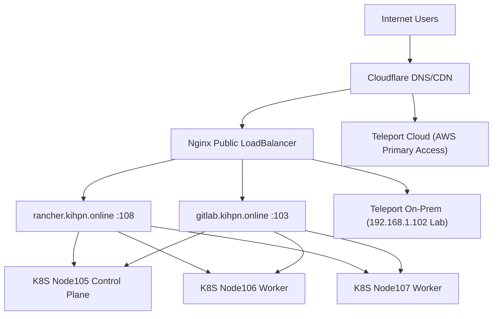

# Platform Architecture Overview

```mermaid
flowchart TD
    Internet["Internet Users"] --> Cloudflare["Cloudflare DNS/CDN"]
    Cloudflare --> LB["Nginx Public LoadBalancer"]

    LB --> Rancher["rancher.kihpn.online :108"]
    LB --> GitLab["gitlab.kihpn.online :103"]

    %% Access Layer
    Cloudflare --> TeleportCloud["Teleport Cloud (AWS Primary Access)"]
    LB --> TeleportOnprem["Teleport On-Prem (192.168.1.102 Lab)"]

    %% Kubernetes Cluster
    Rancher --> Node105["K8S Node105 Control Plane"]
    Rancher --> Node106["K8S Node106 Worker"]
    Rancher --> Node107["K8S Node107 Worker"]

    %% CI/CD
    GitLab --> Node105
    GitLab --> Node106
    GitLab --> Node107
```
