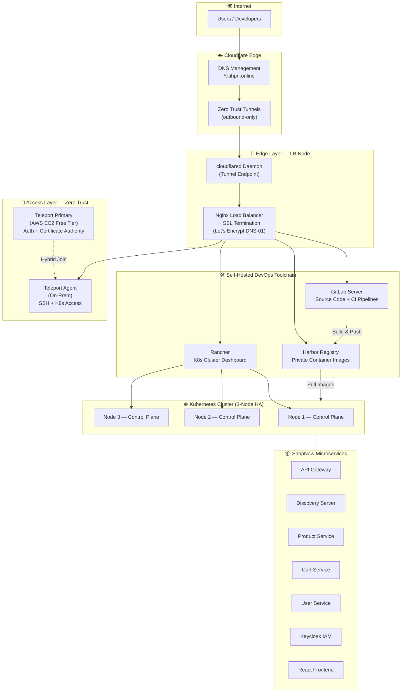

# 🏛️ Platform Architecture Overview

## Why This Folder Exists

This folder documents the **high-level architecture** of the entire On-Premises DevSecOps Platform — giving anyone (engineers, hiring managers, or teammates) a single place to understand how all components connect and how traffic flows from the Internet to the application.

---

## Architecture Diagram



---

## Traffic Flow (How a Request Reaches the App)

```
1. User types https://shopnow.kihpn.online in browser
2. → Cloudflare DNS resolves to Cloudflare Edge (Tunnel CNAME)
3. → Cloudflare Tunnel routes encrypted traffic to cloudflared daemon on LB Node
4. → Nginx LB terminates SSL and proxies to the K8s Ingress Controller (NodePort 30080)
5. → NGINX Ingress Controller routes to the correct K8s Service
6. → Pod serves the response back through the same chain
```

> **Key insight:** All inbound traffic flows through Cloudflare Tunnels — there are **zero inbound ports** opened on the home network router. This bypasses ISP port blocking and provides enterprise-level security.

---

## Layer Breakdown

| Layer | Components | Responsibility |
|---|---|---|
| **Edge** | Cloudflare DNS + Tunnel, Nginx LB | Traffic ingress, SSL termination, routing |
| **Access** | Teleport (AWS Primary + On-Prem Agent) | Zero Trust SSH/K8s access with audit trail |
| **DevOps** | GitLab, Harbor | Source control, CI pipelines, private image registry |
| **Platform** | Kubernetes (kubeadm), Rancher, Helm | Container orchestration, cluster management |
| **Application** | ShopNow (Spring Boot + React) | E-commerce microservices with Keycloak auth |

---

## Design Decisions

1. **Cloudflare Tunnel over VPN** — Simpler to manage, no static public IP needed, ISP-agnostic
2. **Teleport over OpenSSH** — Session recording, RBAC, certificate-based auth, no port 22 exposed
3. **Harbor over Docker Hub** — Full control over images, vulnerability scanning built-in, air-gap ready
4. **kubeadm over managed K8s** — Demonstrates deep understanding of K8s internals (etcd, control plane, CNI)
5. **Nginx LB over cloud LB** — On-prem requirement, full control over routing rules and SSL
