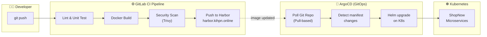

# ⚙️ CI/CD Pipeline (Planned Architecture)

## Why This Folder Exists

This folder is the designated location for CI/CD pipeline configurations — defining how code moves from a developer's commit to a running container on the Kubernetes cluster.

---

## Current State

The CI/CD workflow is currently **manual** — images are built on the Dev Server, pushed to Harbor, and deployed via `kubectl apply`. This was a deliberate choice to first stabilize the infrastructure layer before automating the software delivery layer.

## Target Architecture

---

## Planned CI Pipeline (GitLab CI)

The `.gitlab-ci.yml` will include these stages:

| Stage | Tool | Purpose |
|---|---|---|
| **Lint** | Hadolint | Validate Dockerfile best practices |
| **Test** | Maven / npm | Run unit tests |
| **Build** | Docker (Kaniko) | Build container image inside K8s |
| **Scan** | Trivy | Detect CRITICAL/HIGH vulnerabilities |
| **Push** | Harbor API | Push verified image to private registry |

## Planned CD Pipeline (ArgoCD — GitOps)

| Feature | Configuration |
|---|---|
| **Model** | Pull-based (ArgoCD polls Git repository) |
| **Sync** | Automated every 3 minutes |
| **Self-Heal** | Reverts manual changes on the cluster |
| **Prune** | Removes orphaned resources |
| **Rollback** | `argocd app rollback` for emergency |

### Why ArgoCD?

- **Pull-based** — Works behind NAT/firewall (no webhook needed from GitLab to K8s)
- **GitOps** — Git is the single source of truth for cluster state
- **Audit trail** — Every deployment is a Git commit
- **Self-healing** — Automatic drift detection and correction

---

## Why Not Yet Deployed

> Due to current home lab hardware constraints (8 VMs already consuming most resources), ArgoCD and a full GitLab Runner have not been deployed yet. The architecture is designed to plug them in with minimal changes once additional hardware is available.
